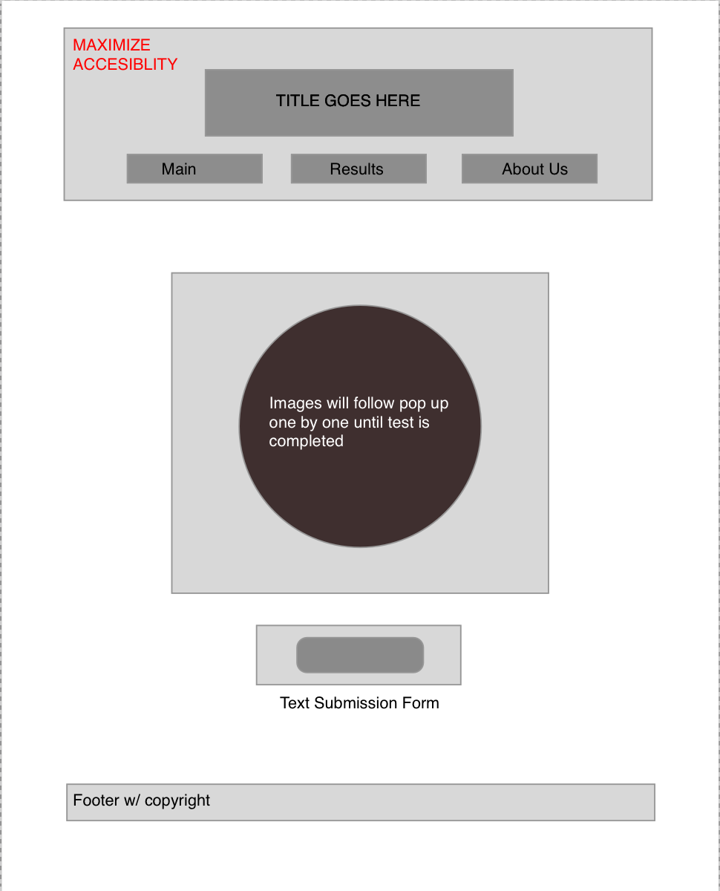

# chroma-vision

--- 
## Team Members

- Shane Roach
- Robb Alexander
- Hambalieu Jallow

---
## Project Description:
An app that tests color blindness. Based on ishihara test.On the app we are going to have Flat images with different colors show up for the User to enter a number thats on the image.Our App will then record the User scores and then show the User the information about different color blindness based on score.

--- 

## Wireframe:

---

## Domain Model:

---
## User Stories:

[User Stories on Trello](https://trello.com/c/0sLln4ac)

---
## Documentation

### 12.20.21 Day 1
- This was planning day. We did not code this day but outlined what each page would look like and how they would function. 
- Created repo for the project.
- Planned layout of pages with wireframe.
- Domain model was created and can be accesed above. 
- Group agreements were finsihed and added to the project repo.
- requirments.md was added to outline the goals of the project.

### 12.21.21 Day 2
- Built structure of website with 3 html pages, 2 Css sheets, and 1 js file.
- Researched information about color blindness and added to the results page.
- Located Ishihara test images and added them to JS portion
- Built javascript file to add functionaility to the test.

### 12.22.21 Day 3
- Hit MVP!
- Started add CSS to make the page more accesible. All images selected were checked using the image file color checker.
- Started working on about us animated prism.
- Started workling on CSS to redesign the style of each page. Used the wireframe as an example layout. Lots of tweaking.
- Added JS file for results page. This allowed us to access local storage to track results from test. 

### 12.27.21 Day 4
- Added randomizer to generate random test sequence.
- redesigned CSS/html structure of results page.
- Continued working on animated prism on about us page.
- Added information to about us page.
- Started working on progress bar to track current stage of test. 
- Found more images to provide information on color blindness. 

### 12.28.21 Day 5
- Fixed minor bug issues with test. Correct answers were not being recorded. 
- Implemented final prism animation to about us page.
- Finished and implemented progress bar to test to track current stage of test. 
- Revised the information in each grid cell on the results page. 
- Fixed several CSS styling issues.
- Implemented testing procedures to test the functionailty and accesibility of website. This included console checking, local storage, and image checking. 
- added JS file for about us page.

## Resources

#### Fonts
- Roboto Mono, Designer - Christian Robertson, https://fonts.google.com/specimen/Roboto

#### Photo Credits

- https://unsplash.com/photos/gvptKmonylk - Linus Mimietz
- https://www.boredpanda.com/different-types-color-blindness-photos/?utm_source=google&utm_medium=organic&utm_campaign=organic - Giedrė Vaičiulaitytė
- https://www.color-blindness.com/ishiharas-test-for-colour-deficiency-38-plates-edition/ - Ishihara Test Plates

